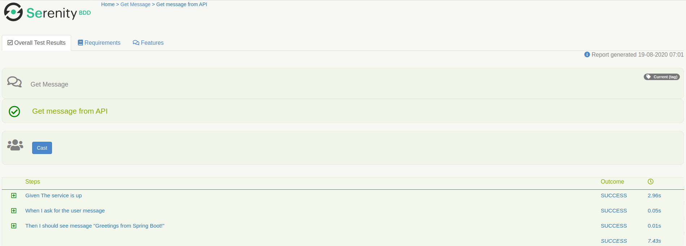
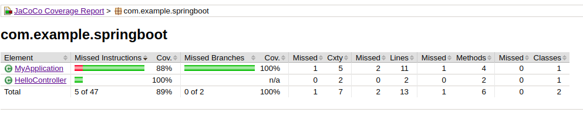

# serenity-bdd + cucumber + springboot code coverage

In this repository are expose two ways of get the code coverage of the springboot application under test, 
when using Serenity-BDD with cucumber and rest assured for executing Integration tests.

For both cases the application and tests are running locally, but the configuration can be moved to any CI/CD server

## 1. First Way: Use manually jacoco agent and cli jars

Simple but in real life we would have to store and kill springboot app PID from terminal

See [springboot-app/run-with-jacoco.sh](springboot-app/run-with-jacoco.sh )

    #Don't run this file, It wont work, this is an example
    # run each line in separate terminal if needed
    java -javaagent:jacocoagent.jar=address=*,port=36320,destfile=jacoco-it.exec,output=tcpserver -jar target/spring-boot-0.0.1-SNAPSHOT.jar
    #Run your tests here
    # e.g
    # cd ../integration-tests-folder && mvn clean verify && cd ../back-here
    java -jar jacococli.jar dump --address localhost --port 36320 --destfile target/jacoco-it.exec
    java -jar jacococli.jar report target/jacoco-it.exec --classfiles target/classes/com --sourcefiles src/main/java/ --html target/jacoco-report

## 2. Second Way: Optionally run springboot app with serenity-BDD + cucumber + rest assured project

The application itself is added as a dependency to the test project [serenity-integration-test-project/pom.xml](serenity-integration-test-project/pom.xml)
and only if env var -Dspring.profiles.active contains 'local-it' the test execution will raise the app before the integration tests
otherwise it will run only the tests

For starting the jacoco agent I used maven jacoco plugin, but
I still had to use jacococli.jar for generating the report as the plugin don't support custom
source path.

So for execute it, first install springboot-app in you local maven repository

    cd springboot-app/
    mvn clean install

To run tests and get coverage report run:

    cd serenity-integration-test-project/
    mvn clean verify
